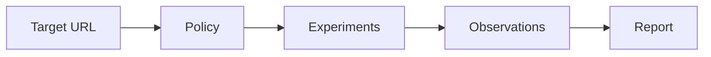
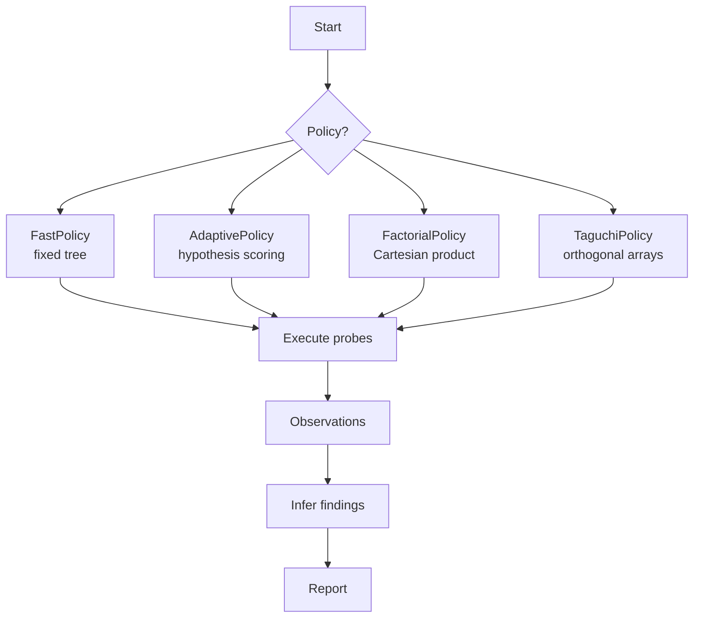
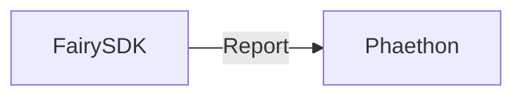

<div align="center">

<picture>
  <source media="(prefers-color-scheme: dark)" srcset="assets/fairy-wordmark-dark.svg">
  
</picture>

<br/>


<br/>

**Controlled network experiments. Experiment data. Path failure diagnosis.**

[](https://golang.org/)
[](https://github.com/arahe-dev/fairy)
[](LICENSE)

</div>

---

## One survey. Structured experiment data. No guessing.

FairySDK is a small Go library and CLI that runs **controlled network
experiments** against a target and returns a structured `Report` of what
happened — and, more importantly, **where the path fails** and **what the
experiment data supports**.

> **Status.** FairySDK **v0.1.1** is implemented: `Survey(ctx, url)`,
> the advanced `New(Config)` constructor, all six probes, the four
> policies, structured experiment data, findings, JSON output, the CLI,
> and restartable `SurveyState`. Dependencies are fixed (see go.mod).

---

## What is FairySDK?

FairySDK is a **controlled network experiment framework**. You give it a
target URL; it runs a sequence of layered probes (DNS, TCP, TLS, HTTP, UDP,
QUIC), converts raw errors into **structured experiment data**, and produces
a `Report` with findings and confidence levels.

* **Experiments are deterministic.** Same inputs — same experiment ID. That
  gives deduplication, restartability, and reproducibility for free.
* **Raw errors become structured experiment data.** `ECONNREFUSED`, `TLS alert 42`,
  `QUIC handshake timeout` — each becomes a typed `Evidence` value, not a
  debug print.
* **Inference is experiment-first.** Findings carry confidence levels and
  reference the observations that support them. Fairy never claims "firewall
  blocked this" when all it knows is "TCP timed out."
* **Policies control experiment selection.** `FastPolicy` walks a fixed tree;
  `AdaptivePolicy` selects follow-up experiments to separate competing
  hypotheses. Both are pure functions over `SurveyState`.



---

## Contents

- [What is FairySDK?](#what-is-fairysdk)
- [Repository shape](#repository-shape)
- [Core types](#core-types)
- [Experiment model](#experiment-model)
- [Probe interface](#probe-interface)
- [Probe implementations](#probe-implementations)
- [Policy model](#policy-model)
- [Policies](#policies)
- [Inference layer](#inference-layer)
- [Report](#report)
- [Concurrency](#concurrency)
- [Time budgets](#time-budgets)
- [Restartability](#restartability)
- [Phaethon boundary](#phaethon-boundary)
- [Quickstart](#quickstart)
- [Current status](#current-status)
- [Roadmap](#roadmap)
- [Design principles](#design-principles)
- [Docs](#docs)
- [License](#license)

---

## Repository shape

```text
fairysdk/
├── fairy.go
├── target.go
├── report.go
├── observation.go
├── evidence.go
├── state.go
│
├── probe/
│   ├── dns.go
│   ├── tcp.go
│   ├── tls.go
│   ├── http.go
│   ├── udp.go
│   ├── quic.go
│   └── common.go
│
├── policy/
│   ├── policy.go
│   ├── fast.go
│   ├── adaptive.go
│   ├── factorial.go
│   └── taguchi.go
│
├── infer/
│   └── infer.go
│
├── internal/
│   ├── model/
│   │   └── types.go
│   └── runner.go
│
├── cmd/fairy/
│   └── main.go
│
└── *_test.go
```

A single Go module. No sub-modules.

---

## Core types

```go
type Target struct {
    URL  *url.URL
    Host string
    Port uint16
}

type Layer string

const (
    LayerDNS  Layer = "dns"
    LayerTCP  Layer = "tcp"
    LayerTLS  Layer = "tls"
    LayerHTTP Layer = "http"
    LayerUDP  Layer = "udp"
    LayerQUIC Layer = "quic"
)

type Status string

const (
    Pass    Status = "pass"
    Fail    Status = "fail"
    Timeout Status = "timeout"
    Skipped Status = "skipped"
    Unknown Status = "unknown"
)
```

The central object:

```go
type Observation struct {
    Experiment Experiment    `json:"experiment"`
    Layer      Layer         `json:"layer"`
    Status     Status        `json:"status"`
    Duration   time.Duration `json:"duration"`
    Evidence   []Evidence    `json:"evidence,omitempty"`
    Error      string        `json:"error,omitempty"`
}
```

Do **not** return raw errors as your diagnostic model. Convert them into
structured experiment data.

```go
type Evidence struct {
    Kind   string         `json:"kind"`
    Values map[string]any `json:"values,omitempty"`
}
```

---

## Experiment model

```go
type Experiment struct {
    ID        string       `json:"id"`
    Target    Target       `json:"target"`
    Layer     Layer        `json:"layer"`
    IPFamily  IPFamily     `json:"ip_family,omitempty"`
    Transport Transport    `json:"transport,omitempty"`
    Resolver  ResolverMode `json:"resolver,omitempty"`
    ALPN      string       `json:"alpn,omitempty"`
    SNI       string       `json:"sni,omitempty"`
    Payload   int          `json:"payload,omitempty"`
}
```

Categorical values are enums — not `float64`:

```go
type IPFamily string
const (
    IPv4 IPFamily = "ipv4"
    IPv6 IPFamily = "ipv6"
)

type Transport string
const (
    TCP  Transport = "tcp"
    UDP  Transport = "udp"
    QUIC Transport = "quic"
)
```

Experiment IDs are generated from canonical inputs — same inputs produce
the same ID, giving deduplication and restartability for free.

---

## Probe interface

```go
type Probe interface {
    Run(context.Context, Experiment) Observation
}
```

Users do **not** register probes in V0. The runner chooses the right probe
internally.

---

## Probe implementations

| Probe | Captures |
|-------|----------|
| DNS | resolved addresses, rcode, latency, NXDOMAIN, SERVFAIL, timeout |
| TCP | connect success, duration, ECONNREFUSED, reset, local/remote addr |
| TLS | version, cipher, cert names/issuer, ALPN, alert, handshake latency |
| HTTP | status, protocol, redirects, headers, TTFB, total duration |
| UDP | basic reachability; returns `Unknown` where data is insufficient |
| QUIC | UDP connectivity, handshake result, version, ALPN, HTTP/3 response |

DoH/DoT, raw ICMP, and custom proxy protocols are **not** in V0.

---

## Policy model

```go
type Policy interface {
    Propose(context.Context, SurveyState, int) ([]Experiment, error)
    Done(SurveyState) bool
}
```

`Propose` is **pure**: same config + same `SurveyState` = same experiments.
No hidden mutation inside policies.

---

## Policies



**FastPolicy** — Default. Deterministic tree: DNS → TCP → TLS → HTTP → QUIC.
Only runs dependent probes if prerequisites pass. Typical survey: 4–7 probes.

**AdaptivePolicy** — After the basic tree, compares plausible hypotheses
(e.g. TCP succeeds but TLS fails → compare IPv4 vs IPv6, target vs control,
SNI variants, h2 vs h1). Selects the experiment that best separates
unresolved hypotheses.

**FactorialPolicy** — Diagnostic mode. Cartesian product of factors with
a hard maximum on candidate count.

**TaguchiPolicy** — Orthogonal arrays (L9/L27) for multi-factor experiments.
Not for ordinary survey flow.

---

## Inference layer

```go
func Infer(state SurveyState) []Finding

type Finding struct {
    Kind       string     `json:"kind"`
    Confidence Confidence `json:"confidence"`
    Evidence   []string   `json:"evidence"`
}
```

Confidence: `Confirmed` · `Likely` · `Possible` · `InsufficientEvidence`

Experiment data first. Interpretation second.

---

## Report

```go
type Report struct {
    Target       Target        `json:"target"`
    StartedAt    time.Time     `json:"started_at"`
    Duration     time.Duration `json:"duration"`
    Observations []Observation `json:"observations"`
    Findings     []Finding     `json:"findings"`

    // State is the survey state that produced this report. It is not
    // serialized with the report; persist it separately for resume.
    State *SurveyState `json:"-"`
}
```

```
FAIRY SURVEY

Target: https://example.com

DNS        PASS      18ms
TCP/443    PASS      31ms
TLS        PASS      42ms
HTTP/2     PASS      87ms
QUIC       FAIL      timeout

Finding:
  QUIC unavailable on this path
  Confidence: likely
  Evidence:
    - TCP/443 succeeds
    - TLS over TCP succeeds
    - UDP/443 QUIC handshake timed out
```

JSON: `fairy survey https://example.com --json`

---

## Concurrency

`errgroup.Group` with `SetLimit(config.MaxConcurrent)`. Default: 4.

Only independent experiments run concurrently. Dependent probes
(DNS → TCP → TLS) execute sequentially.

---

## Time budgets

| Scope | Budget |
|-------|--------|
| Whole survey | 10 s |
| DNS | 2 s |
| TCP | 2 s |
| TLS | 3 s |
| HTTP | 3 s |
| QUIC | 3 s |

---

## Restartability

`SurveyState` is JSON-serialized. Advanced API:

```go
report, err := f.Resume(ctx, state)
```

Completed experiments are immutable. Same experiment ID is never rerun
unless explicitly requested.

---

## Phaethon boundary



No reverse dependency. Fairy knows nothing about VPN routing.

---

## Quickstart

```bash
go install github.com/arahe-dev/fairy/cmd/fairy@latest
```

```go
report, err := fairy.Survey(ctx, "https://example.com")
```

```go
f, err := fairy.New(fairy.Config{
    Policy:    fairy.Adaptive,
    MaxProbes: 16,
    Timeout:   8 * time.Second,
})
report, err := f.Survey(ctx, "https://example.com")
```

```bash
fairy survey https://example.com
fairy survey https://example.com --json
```

---

## Current status

v0.1.1 — implemented and race-clean (`go test -race ./...`), release
pending. `fairy survey https://example.com` returns structured results
from DNS, TCP, TLS, HTTP, UDP, and QUIC with a deterministic `Report`.

---

## Roadmap

- [x] Go API freeze (`Survey`, `New`, `Config`)
- [x] DNS / TCP / TLS / HTTP / QUIC / UDP probes
- [x] FastPolicy + basic AdaptivePolicy
- [x] Structured Evidence + Findings
- [x] JSON output + CLI
- [x] Restartable `SurveyState`
- [x] `go test -race ./...` clean
- [x] v0.1.1 release
- [x] FactorialPolicy, TaguchiPolicy

Non-goals for V0: packet capture, eBPF, traceroute, raw ICMP, DoH, DoT,
custom proxy protocols, GUI, distributed execution, ML inference.

---

## Design principles

1. Experiments are deterministic — same inputs, same ID.
2. Raw errors become structured experiment data — never a debug print.
3. Inference is experiment-first — confidence levels, not guesses.
4. Policies are pure — no hidden mutation.
5. A survey feels instant — tight time budgets by default.
6. Fairy stays in its lane — it produces reports, not routing decisions.

---

## Docs

- `docs/concepts.md` — Target, Observation, Evidence, Finding, Experiment
- `docs/experiment-model.md` — deterministic IDs, layers, survey state
- `docs/probe-contract.md` — the `Probe` interface
- `docs/policy-model.md` — Fast, Adaptive, Factorial, Taguchi
- `docs/inference.md` — from observations to findings
- `docs/architecture.md` — runtime boundary

---

## Contributing / Security

- CONTRIBUTING.md
- CODE_OF_CONDUCT.md
- SECURITY.md

## License

Apache-2.0 — see LICENSE.
