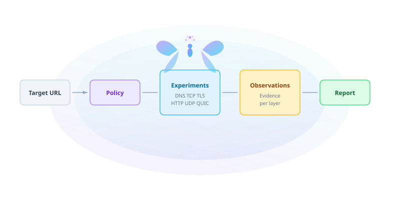

<div align="center">

<picture>
  <source media="(prefers-color-scheme: dark)" srcset="assets/fairy-wordmark-dark.svg">
  
</picture>

<br/>

**Controlled network experiments. Evidence. Path failure diagnosis.**

[](https://golang.org/)
[](https://github.com/arahe-dev/FairySDK)
[](LICENSE)

</div>

---

## One survey. Structured evidence. No guessing.

FairySDK is a small Go library and CLI that runs **controlled network
experiments** against a target and returns a structured `Report` of what
happened — and, more importantly, **where the path fails** and **what the
evidence supports**.

> **Status.** FairySDK **v0.1.0-pre** is in early development. The public
> API is stabilizing: `Survey(ctx, url)` and the advanced `New(Config)`
> constructor. Dependencies are fixed — see below. Everything below is the
> target spec; not all of it is implemented yet. See ROADMAP.md and
> CHANGELOG.md.

---

## Contents

- [What is FairySDK?](#what-is-fairysdk)
- [Repository shape](#repository-shape)
- [Core types](#core-types)
- [Experiment model](#experiment-model)
- [Probe interface](#probe-interface)
- [Probe implementations](#probe-implementations)
- [Policy model](#policy-model)
- [Policies](#policies)
- [Inference layer](#inference-layer)
- [Report](#report)
- [Concurrency](#concurrency)
- [Time budgets](#time-budgets)
- [Restartability](#restartability)
- [Phaethon boundary](#phaethon-boundary)
- [Quickstart](#quickstart)
- [Current status](#current-status)
- [Roadmap](#roadmap)
- [Design principles](#design-principles)
- [Name / inspiration](#name--inspiration)
- [Docs](#docs)
- [License](#license)

---

## What is FairySDK?

FairySDK is a **controlled network experiment framework**. You give it a
target URL; it runs a sequence of layered probes (DNS, TCP, TLS, HTTP, UDP,
QUIC), converts raw errors into **structured evidence**, and produces a
`Report` with findings and confidence levels.

The key ideas:

* **Experiments are deterministic.** Same inputs — same experiment ID. That
  gives deduplication, restartability, and reproducibility for free.
* **Raw errors become structured evidence.** `ECONNREFUSED`, `TLS alert 42`,
  `QUIC handshake timeout` — each becomes a typed `Evidence` value, not a
  debug print.
* **Inference is evidence-first.** Findings carry confidence levels and
  reference the observations that support them. Fairy never claims "firewall
  blocked this" when all it knows is "TCP timed out."
* **Policies control experiment selection.** `FastPolicy` walks a fixed tree;
  `AdaptivePolicy` selects follow-up experiments to separate competing
  hypotheses. Both are pure functions over `SurveyState`.

Start with `docs/concepts.md` and `docs/experiment-model.md`.

<br/>

<picture>
  <source media="(prefers-color-scheme: dark)" srcset="assets/fairy-survey-flow-dark.svg">
  
</picture>

---

## Repository shape

```text
fairysdk/
├── fairy.go
├── target.go
├── report.go
├── observation.go
├── evidence.go
├── state.go
│
├── probe/
│   ├── dns.go
│   ├── tcp.go
│   ├── tls.go
│   ├── http.go
│   ├── udp.go
│   └── quic.go
│
├── policy/
│   ├── policy.go
│   ├── fast.go
│   ├── adaptive.go
│   ├── factorial.go
│   └── taguchi.go
│
├── infer/
│   └── infer.go
│
├── internal/
│   └── runner.go
│
├── cmd/fairy/
│   └── main.go
│
└── *_test.go
```

A single Go module. No sub-modules.

---

## Core types

```go
type Target struct {
    URL  *url.URL
    Host string
    Port uint16
}

type Layer string

const (
    LayerDNS  Layer = "dns"
    LayerTCP  Layer = "tcp"
    LayerTLS  Layer = "tls"
    LayerHTTP Layer = "http"
    LayerUDP  Layer = "udp"
    LayerQUIC Layer = "quic"
)

type Status string

const (
    Pass    Status = "pass"
    Fail    Status = "fail"
    Timeout Status = "timeout"
    Skipped Status = "skipped"
    Unknown Status = "unknown"
)
```

The central object:

```go
type Observation struct {
    Experiment Experiment    `json:"experiment"`
    Layer      Layer         `json:"layer"`
    Status     Status        `json:"status"`
    Duration   time.Duration `json:"duration"`
    Evidence   []Evidence    `json:"evidence,omitempty"`
    Error      string        `json:"error,omitempty"`
}
```

Do **not** return raw errors as your diagnostic model. Convert them into
structured evidence.

```go
type Evidence struct {
    Kind   string         `json:"kind"`
    Values map[string]any `json:"values,omitempty"`
}
```

Example evidence kinds:

```text
dns_answer
tcp_refused
tcp_reset
tls_alert
certificate
http_status
alpn_selected
quic_handshake_failure
timeout
```

---

## Experiment model

```go
type Experiment struct {
    ID        string
    Target    Target
    IPFamily  IPFamily
    Transport Transport
    Resolver  ResolverMode
    ALPN      string
    Payload   int
}
```

Categorical values are enums — not `float64`:

```go
type IPFamily string
const (
    IPv4 IPFamily = "ipv4"
    IPv6 IPFamily = "ipv6"
)

type Transport string
const (
    TCP  Transport = "tcp"
    UDP  Transport = "udp"
    QUIC Transport = "quic"
)
```

Experiment IDs are generated from canonical inputs:

```go
func ExperimentID(e Experiment) string {
    // canonical serialize -> SHA256 -> first 12 hex chars
}
```

This gives deduplication and restartability for free.

---

## Probe interface

One tiny internal contract:

```go
type Probe interface {
    Run(context.Context, Experiment) Observation
}
```

Users do **not** register probes in V0. The runner chooses the right probe
internally.

```go
func run(ctx context.Context, e Experiment) Observation
```

---

## Probe implementations

### DNS

Uses `net.Resolver.LookupIPAddr` for the system resolver. For explicit
resolver comparisons, uses `miekg/dns`.

Captures: resolved addresses, rcode, latency, IPv4/IPv6 presence, NXDOMAIN,
SERVFAIL, timeout.

DoH/DoT are **not** in V0.

### TCP

Uses `net.Dialer{...}.DialContext(ctx, "tcp", addr)`.

Captures: connect success, duration, ECONNREFUSED, timeout, connection
reset, local/remote addr.

For family control, resolve first, then dial the explicit IP.

### TLS

Uses `tls.Client(conn, &tls.Config{ServerName: host, NextProtos: []string{"h2", "http/1.1"}})` and `HandshakeContext(ctx)`.

Captures: TLS version, cipher suite, peer certificate names, certificate
issuer, selected ALPN, alert/error category, handshake latency.

Dial IP and set `ServerName` separately — this lets Fairy distinguish
routing from hostname-dependent TLS behavior.

### HTTP

Uses a custom `http.Transport` — never `http.DefaultClient`. Redirects are
disabled (`CheckRedirect` returns `http.ErrUseLastResponse`).

Captures: status, protocol, redirects, server headers, TTFB, total duration.

### UDP

Uses `net.UDPConn`. V0 only needs basic reachability experiments against
controlled endpoints. Returns `Unknown` where evidence is insufficient —
do not pretend arbitrary UDP silence means "blocked."

### QUIC / HTTP/3

Uses `github.com/quic-go/quic-go` and `github.com/quic-go/quic-go/http3`.

Captures: UDP connectivity evidence, QUIC handshake result, QUIC version,
ALPN, handshake duration, HTTP/3 response when applicable.

Do not implement QUIC yourself.

---

## Policy model

```go
type Policy interface {
    Propose(context.Context, SurveyState, int) ([]Experiment, error)
    Done(SurveyState) bool
}

type SurveyState struct {
    SurveyID     string        `json:"survey_id"`
    Round        int           `json:"round"`
    Observations []Observation `json:"observations"`
    Rounds       []Round       `json:"rounds"`
}
```

`Propose` is **pure**: same config + same `SurveyState` = same experiments.
No hidden mutation inside policies.

---

## Policies

### `FastPolicy`

Default. Deterministic tree:

```text
DNS
 ↓
TCP 443
 ↓
TLS
 ↓
HTTP
 ↓
QUIC/H3
```

Only runs dependent probes if prerequisites pass. Typical survey: **4–7
probes**.

### `AdaptivePolicy`

After the basic tree, compares plausible hypotheses. Example:

```text
TCP succeeds
TLS fails

→ compare:
  IPv4 vs IPv6
  target vs control
  SNI target vs controlled comparison
  h2 vs h1
```

Selects the next experiment based on which unresolved hypothesis it
separates. Simple scoring in V0:

```go
score =
    hypothesesSeparated*10 -
    estimatedCost -
    duplicatePenalty
```

Pick the highest score.

### `FactorialPolicy`

Diagnostic/development mode. Generates the Cartesian product of factors
with a hard maximum on candidate count.

### `TaguchiPolicy`

Optional. Reuses L9/L27 orthogonal arrays conceptually. Only for
multiple independent factors × fixed discrete levels × meaningful
combinations. Not for ordinary survey flow.

---

## Inference layer

```go
func Infer(state SurveyState) []Finding

type Finding struct {
    Kind       string     `json:"kind"`
    Confidence Confidence `json:"confidence"`
    Evidence   []string   `json:"evidence"`
}
```

Example finding kinds:

```text
dns_failure
ipv6_path_failure
tcp_unreachable
tls_specific_failure
udp_unavailable
quic_unavailable
http_application_rejection
possible_proxy_interference
```

Confidence levels:

```text
Confirmed
Likely
Possible
InsufficientEvidence
```

Evidence first. Interpretation second.

---

## Report

```go
type Report struct {
    Target       Target        `json:"target"`
    StartedAt    time.Time     `json:"started_at"`
    Duration     time.Duration `json:"duration"`
    Observations []Observation `json:"observations"`
    Findings     []Finding     `json:"findings"`
}
```

Default console output:

```text
FAIRY SURVEY

Target: https://example.com

DNS        PASS      18ms
TCP/443    PASS      31ms
TLS        PASS      42ms
HTTP/2     PASS      87ms
QUIC       FAIL      timeout

Finding:
  QUIC unavailable on this path
  Confidence: likely

Evidence:
  TCP/443 succeeds
  TLS over TCP succeeds
  UDP/443 QUIC handshake timed out
```

JSON output:

```bash
fairy survey https://example.com --json
```

---

## Concurrency

Uses `errgroup.Group` with `SetLimit(config.MaxConcurrent)`. Default
`MaxConcurrent = 4`.

Only independent experiments run concurrently. Dependent probes
(DNS → TCP → TLS) execute sequentially — there is causal value in the
order.

---

## Time budgets

One parent context plus per-probe limits. Recommended defaults:

```text
whole survey     10 s
DNS               2 s
TCP               2 s
TLS               3 s
HTTP              3 s
QUIC              3 s
```

A survey should feel instant. Do not turn diagnostics into a 90-second
ritual.

---

## Restartability

Persist `SurveyState` as JSON. Advanced API:

```go
report, err := f.Resume(ctx, state)
```

Every completed experiment is immutable. Never rerun the same experiment
ID unless explicitly requested.

---

## Phaethon boundary

Fairy knows nothing about VPN routing.

```text
FairySDK
   |
   | Report
   v
Phaethon
```

No reverse dependency. No MASQUE code inside Fairy.

---

## Quickstart

Install:

```bash
go install github.com/arahe-dev/fairy/cmd/fairy@latest
```

Simple survey:

```go
report, err := fairy.Survey(ctx, "https://example.com")
```

Advanced:

```go
f, err := fairy.New(fairy.Config{
    Policy:    fairy.Adaptive,
    MaxProbes: 16,
    Timeout:   8 * time.Second,
})

report, err := f.Survey(ctx, "https://example.com")
```

CLI:

```bash
fairy survey https://example.com
fairy survey https://example.com --json
```

---

## Current status

FairySDK v0.1.0-pre is in early development. The public API, experiment
model, and dependency set are frozen; implementation is underway.

First milestone target:

```bash
fairy survey https://example.com
```

returning structured results from DNS, TCP, TLS, HTTP, and QUIC with a
deterministic `Report`. Then adaptive experiments.

---

## Roadmap

- [ ] Go API freeze (`Survey`, `New`, `Config`)
- [ ] DNS probe
- [ ] TCP probe
- [ ] TLS probe
- [ ] HTTP/1.1 + HTTP/2 probe
- [ ] QUIC / HTTP/3 probe
- [ ] UDP probe (basic)
- [ ] FastPolicy
- [ ] Basic AdaptivePolicy
- [ ] Structured Evidence + Findings
- [ ] JSON output
- [ ] CLI (`cmd/fairy`)
- [ ] Restartable `SurveyState`
- [ ] `go test -race ./...` clean
- [ ] v0.1.0-pre release
- [ ] FactorialPolicy
- [ ] TaguchiPolicy
- [ ] Additional real-world consumers

Explicit non-goals for V0: packet capture, eBPF, traceroute, raw ICMP,
DoH, DoT, custom proxy protocols, GUI, distributed execution, ML-based
inference. Details in ROADMAP.md.

## Design principles

1. Experiments are deterministic — same inputs, same ID.
2. Raw errors become structured evidence — never a debug print.
3. Inference is evidence-first — confidence levels, not guesses.
4. Policies are pure — no hidden mutation.
5. A survey feels instant — tight time budgets by default.
6. Fairy stays in its lane — it produces reports, not routing decisions.

## Name / inspiration

FairySDK is named for the idea of a small, luminous scout — something that
flies out, gathers what it finds, and comes back with evidence rather
than opinions.

<br/>


The mascot is **Bagboo** — a small, bright creature that embodies the
project's spirit: lightweight, evidence-first, and unafraid to fly into
the unknown to find out what's really happening.

> **Disclaimer.** FairySDK is an independent open-source project.

## Docs

- `docs/concepts.md` — Target, Observation, Evidence, Finding, Experiment
- `docs/experiment-model.md` — deterministic IDs, layers, survey state
- `docs/probe-contract.md` — the `Probe` interface and implementation notes
- `docs/policy-model.md` — `FastPolicy`, `AdaptivePolicy`, `FactorialPolicy`, `TaguchiPolicy`
- `docs/inference.md` — from observations to findings
- `docs/architecture.md` — runtime boundary, what Fairy is not

## Contributing / Security

- CONTRIBUTING.md
- CODE_OF_CONDUCT.md
- SECURITY.md

## License

Apache-2.0 — see LICENSE.
